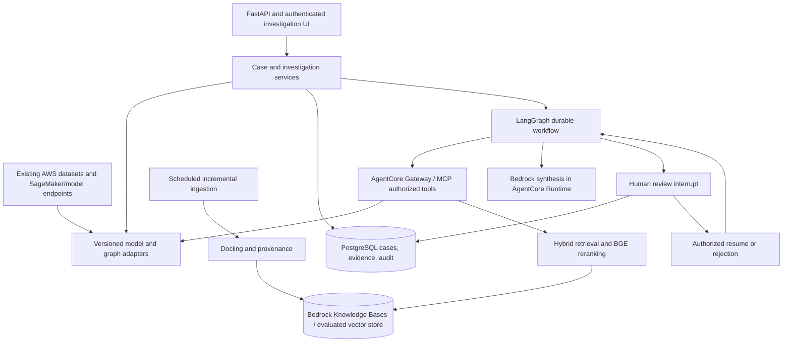

# Agentic Fraud Detection and Investigation Platform

Status: incremental implementation in progress. The local API, persistence, guardrails, and portable inference boundary are implemented; no AWS deployment is claimed. The AWS-first target and current gap matrix are defined in [docs/AWS_TARGET_ARCHITECTURE.md](docs/AWS_TARGET_ARCHITECTURE.md).

## Objective and preservation boundary

Extend the existing AWS Risk Portfolio with evidence-driven investigations, durable agent workflows, and human review. Preserve IEEE-CIS transaction fraud, Home Credit credit risk, and Elliptic graph fraud datasets, models, preprocessing, and working AWS integrations. Add adapters around verified components; do not retrain, replace, move, or overwrite them as part of platform setup.

The selected local workspace initially contained only an empty Git repository. Read-only inspection subsequently identified three related GitHub repositories. Their relationship to any complete local/AWS portfolio must be confirmed before implementation.

## Inspected baseline

| Repository and inspected revision | Observed source | Documentation claims and unresolved artifacts |
| --- | --- | --- |
| [Financial-Transaction-Fraud-Detection-on-AWS](https://github.com/sumanthreddy369/Financial-Transaction-Fraud-Detection-on-AWS), `4994622381ee1e811773177c17fc92f86cf3fb4a` | `Code` contains preprocessing and training sections; `utils.py` and `requirements.txt` are present. Training compares scikit-learn logistic regression, random forest, and gradient boosting; references `sample_data.csv`, `config.yaml`, `models/{best_name}.joblib`, and `outputs/metrics.json`. | README identifies IEEE-CIS, XGBoost, S3, SageMaker, Lambda, API Gateway, and ROC-AUC 0.91. The inspected tree contains no saved model or dataset. README/model-code differences need reconciliation against the actual deployed artifacts. |
| [Credit-Risk-Loan-Default-Prediction](https://github.com/sumanthreddy369/Credit-Risk-Loan-Default-Prediction), `a1c4154698094a811c582ee5c48c590b67b875d4` | `code` provides duplicate removal, numeric median filling, categorical filling, one-hot encoding, and target separation. | README identifies Home Credit, LightGBM, SHAP, S3/SageMaker, and ROC-AUC 0.79. No saved model, training implementation, or dataset appears in the inspected tree. |
| [-Graph-Based-Fraud-Ring-Detection](https://github.com/sumanthreddy369/-Graph-Based-Fraud-Ring-Detection), `6e80be87fa5a4a913f715ca86311225d537a70a2` | `code` reads `sample_graph.csv`, imports `graph_builder.build_graph`, and draws a NetworkX graph. The referenced graph builder is absent from the inspected tree. | README identifies Elliptic, gradient boosting, Neptune/S3/SageMaker, and PR-AUC 0.66. No saved classifier or dataset appears in the inspected tree. |

Reported metrics are README claims, not reproduced results. Referenced output paths are not evidence that saved files exist. Do not reconstruct missing models or infer their feature contracts from these examples.

## Stack decisions

| Area | Initial choice and purpose | Deferred choices |
| --- | --- | --- |
| API and contracts | FastAPI, Pydantic, advanced type hints and typed service interfaces; strict input/output validation and versioned scoring contracts | Preserve existing inference runtime dependencies behind adapters rather than upgrading them globally |
| Durable data | PostgreSQL 17 for a new deployment, or existing PostgreSQL 16 if already provisioned; SQLAlchemy 2.x, psycopg 3.x, Alembic, bounded connection pools | Separate analytics infrastructure only when workload isolation requires it |
| Agent workflows | LangGraph with PostgreSQL checkpoints and bounded ReAct tool selection, hosted in Bedrock AgentCore Runtime after local durability tests | Multi-agent specialization only if evaluation shows value |
| Tool integration | AgentCore Gateway/MCP exposing typed, authorized scoring, evidence lookup, and graph-neighborhood tools; reuse the same application services as REST | Arbitrary code execution, unrestricted SQL, and autonomous account actions are excluded |
| Retrieval | Bedrock Knowledge Bases with an evaluated hybrid path; Neptune Analytics GraphRAG for document relationships; pgvector or Qdrant remains a benchmarked portability option | Milvus adapter only for a concrete portability requirement or measured comparison |
| Document ingestion | Docling first, preserving document/page/chunk provenance; add Unstructured only for demonstrated parsing gaps | No dual-parser infrastructure without a need |
| Enterprise access | IAM and AgentCore Identity with OAuth/OIDC federation; investigator/reviewer/admin authorization remains server controlled | MSAL is used only when Microsoft Entra ID is the selected workforce identity provider |
| ETL | Kinesis or preserved MSK into KMS-encrypted S3; Glue Catalog/jobs and EMR Serverless Spark; Parquet and Iceberg only where table semantics require it | Ray for workloads that benchmarks show are not served well by Spark or bounded workers |
| Concurrency | asyncio and httpx for bounded network I/O; concurrent.futures for blocking libraries; Tenacity for bounded transient-error retries | Redis for measured cache/rate-limit/queue needs; never the authoritative case store |
| Observability | Structured logs, ADOT/OpenTelemetry, CloudWatch and CloudTrail, managed MLflow experiment metrics; redact sensitive trace payloads | Langfuse may be added for evaluation portability, but is not the AWS production system of record |

Exact package versions and compatibility locks will be established against the recovered environments during implementation. Do not change existing model dependencies merely to match this table.

## Target architecture

The three datasets describe different domains and entity identifiers. Keep them separated. Never fabricate joins between IEEE-CIS transactions, Home Credit applicants, and Elliptic nodes. A case records its source domain; cross-domain linkage requires an explicit, independently validated mapping.

Existing AWS inference remains in place. Bedrock receives only approved, minimized evidence for a specific investigation. Model access, inference profiles, Regions, retention, and cross-Region routing must be approved before enabling real data.

## Incremental delivery

### Phase 0: recover and freeze the working baseline

- Locate the complete portfolio checkout, S3 dataset locations, saved models, preprocessing artifacts, feature orders, label mappings, dependency locks, and deployed endpoints.
- Produce a read-only artifact manifest containing source revision, artifact checksum or object version, schema, ownership, and evaluation provenance; avoid scanning large datasets unnecessarily.
- Establish known-input/known-output inference fixtures and record existing behavior before changes. Do not load untrusted serialized models.
- Resolve README/source discrepancies with the authoritative deployed assets. Missing artifacts remain explicit blockers for their adapters.
- Preserve raw data and model directories; put new code and environments in additive locations selected after inspecting the complete repository.

Exit: each adapter has a verified source contract and baseline, or is explicitly unavailable. No placeholder prediction may be presented as a real model result.

### Phase 1: API, persistence, and model adapters

- Add a separate FastAPI service with validated contracts, configuration, readiness/liveness checks, and secret-free example configuration.
- Wrap existing IEEE-CIS, credit, and Elliptic inference independently; include model version and input schema version in every result. Preserve original preprocessing and class semantics.
- Add PostgreSQL tables and Alembic migrations for cases, score references, evidence, investigation runs, review decisions, and append-only audit events.
- Introduce identity verification and role enforcement before exposing case data to shared users. Bind roles to authenticated identities, not client-submitted fields.
- Add a basic investigator interface for creating a case and viewing scores/evidence. Reuse an existing suitable frontend if one is found.

Exit: a case can reference a verified model result; invalid input is rejected; unavailable models return explicit errors; adapter predictions match the baseline within documented tolerances. Migrations apply to a clean database and an upgrade fixture.

### Phase 2: ingestion and evidence retrieval

- Add hourly/daily incremental jobs with source watermarks, deduplication, resumable batches, idempotent writes, and extraction-run records.
- Normalize timestamps to UTC while retaining original offset/source metadata. Quarantine ambiguous timestamps and incompatible schema changes rather than silently coercing them.
- Use Pandas/PyArrow for new transformations, with SQL CTEs and window functions for case analytics. Validate column types, row counts, null rates, and source changes.
- Parse approved documents with page/chunk provenance, content hashes, access-control metadata, parser version, and embedding version.
- Retrieve dense and BM25 candidates through the selected Bedrock Knowledge Bases or benchmarked vector-store adapter, fuse rankings with RRF when the backend does not supply an equivalent hybrid strategy, and benchmark BGE reranking of the fused shortlist. Handle transaction/account IDs with exact structured lookup when appropriate.
- Enforce domain and access filters before retrieval and reranking; propagate document revocation/deletion to the indexes.
- Tune HNSW parameters against recall, p95 latency, ingestion time, and memory. Do not index vectors used exclusively for reranking.

Exit: repeat ETL runs do not duplicate data; failures can resume; evidence references resolve to original sources; unauthorized documents cannot enter the candidate set. Compare dense-only, BM25-only, hybrid, and reranked results on held-out relevance labels.

### Phase 3: agent investigation and MCP

- Implement typed LangGraph state containing case/run IDs, score references, evidence IDs, tool outcomes, budget counters, and review status.
- Run a bounded workflow: load case -> choose approved investigative tools -> collect evidence -> identify conflicting/missing evidence -> generate a cited recommendation -> interrupt for review.
- Expose narrow MCP tools such as `get_case_evidence`, `score_transaction`, `score_credit_record`, `get_graph_neighborhood`, and `search_policy`. Authorize at the tool boundary as well as the API boundary.
- Treat retrieved text as untrusted data. Validate tool inputs and structured model outputs; reject citations outside the retrieved evidence set and abstain when evidence is insufficient.
- Set timeouts, tool/iteration limits, token budgets, and cancellation. Retry transient read failures with jitter; retry writes only with idempotency protection.
- Persist checkpoints in PostgreSQL with stable run identifiers. Keep consequential state mutations outside replay-prone graph nodes or protect them with transactional idempotency/outbox records.

Exit: a workflow survives process restart, returns source-linked evidence, respects tool permissions and budgets, and cannot bypass the review interrupt. Test dependency failures and malicious document instructions.

### Phase 4: human investigation workflow

- Deliver a case queue and detail view with original scores, graph evidence, retrieved document excerpts, recommendation, and provenance.
- Support approve, reject, and request-more-evidence decisions with authenticated reviewer identity, rationale, timestamps, and the reviewed evidence/run version.
- Model lifecycle explicitly: open -> investigating -> awaiting_review -> approved/rejected, with request-more-evidence returning to investigation. Closing a case is a separately authorized transition.
- Use optimistic concurrency or transactional row locks so duplicate/stale review submissions cannot produce competing decisions. Bind each decision to the pending interrupt and authenticated case access.
- Resume only through the authorized review endpoint. The agent cannot approve its own recommendation. Approval records an investigation outcome; account blocking or lending actions require a separately scoped integration and authorization policy.

Exit: duplicate and stale reviews are safely rejected or replayed idempotently; unauthorized reviewers cannot act; pending reviews survive restart; the full case history is reconstructable.

### Phase 5: evaluation and operational readiness

- Reproduce available existing model evaluations without changing training/splits. Keep fraud PR-AUC, recall/precision at review capacity, credit calibration/discrimination, and graph metrics separate from retrieval metrics.
- Build relevance judgments for NDCG@k, MRR, and Recall@k. Use held-out/time-separated queries where applicable; choose k values and thresholds before tuning on the test set.
- Evaluate grounded citations, unsupported assertions, evidence completeness, appropriate abstention, analyst acceptance/override rate, latency, and investigation cost.
- Instrument ADOT/OpenTelemetry and CloudWatch with redaction and retention controls. Durable review/audit records remain in PostgreSQL; managed MLflow stores approved experiment and evaluation metrics.
- Validate PostgreSQL checkpoint recovery, backups/restore, retrieval-backend outage handling, bounded connection pools, secret rotation, access isolation, and migration rollback/forward-fix procedures.
- Deploy additively with a feature flag and limited initial traffic. Roll back by disabling the new investigation layer; existing AWS scoring remains independently available.

Exit: agreed quality and operational gates pass on representative data; documented failures remain visible; no production-readiness claim relies only on mocked tests.

## Initial API and data contracts

Proposed routes, adapted to existing APIs after inventory:

- `POST /v1/cases`: create a domain-specific case with an idempotency key.
- `GET /v1/cases/{case_id}`: return authorized case state and evidence references.
- `POST /v1/cases/{case_id}/investigations`: start a durable investigation; return a run ID.
- `GET /v1/investigations/{run_id}`: return progress, dependency errors, and pending review.
- `POST /v1/investigations/{run_id}/reviews`: submit a version-bound analyst decision and resume when permitted.
- `GET /v1/cases/{case_id}/audit`: return authorized chronological audit history.

Core records: `cases`, `model_score_references`, `evidence_items`, `investigation_runs`, `review_decisions`, `audit_events`, `ingestion_runs`, and an outbox when asynchronous side effects are introduced. LangGraph checkpoint tables are managed through its supported setup/migration process. Raw source datasets remain in their existing locations.

## Verification strategy

1. Golden inference fixtures confirm adapter parity with original preprocessing and models.
2. Real PostgreSQL integration tests cover transactions, migrations, checkpoints, restart/resume, and concurrent review submissions.
3. Retrieval integration tests verify metadata filters, source deletion, hybrid fusion, and retrieval behavior on a labeled fixture corpus for the selected backend.
4. Identity/tool tests cover missing/invalid tokens, unauthorized roles, domain isolation, and prompt-injection attempts.
5. End-to-end tests create a case, collect evidence, interrupt, approve/reject/request more evidence, restart a worker, and verify audit consistency.
6. External-service tests use controlled fixtures locally; separate opt-in smoke tests validate real AWS endpoints and Bedrock/AgentCore deployments without transmitting unrestricted production data.

## Immediate next work and external inputs

The next implementation increment is Phase 0 plus a minimal verified adapter/API slice, not a simultaneous build of every optional component. Required inputs are the authoritative portfolio path, dataset/model locations, existing AWS endpoint configuration, and later deployment identity/Bedrock configuration. Credentials belong in AWS Secrets Manager, Parameter Store, or local untracked environment configuration, never in this plan or Git.

Redis, Ray, Qdrant, Langfuse, and Milvus are deliberately conditional decisions. Add them only when a workload benchmark, portability goal, or deployment requirement demonstrates a concrete benefit. The AWS target architecture is the default.

## Technical references

- [Qdrant hybrid queries and RRF](https://qdrant.tech/documentation/search/hybrid-queries/)
- [Ray data loading and Pandas/Arrow interoperability](https://docs.ray.io/en/latest/data/loading-data.html)
- [Langfuse evaluation methods](https://langfuse.com/docs/evaluation/evaluation-methods/code-evaluators)

Inspect current official API documentation and lock tested versions before implementing each integration.
