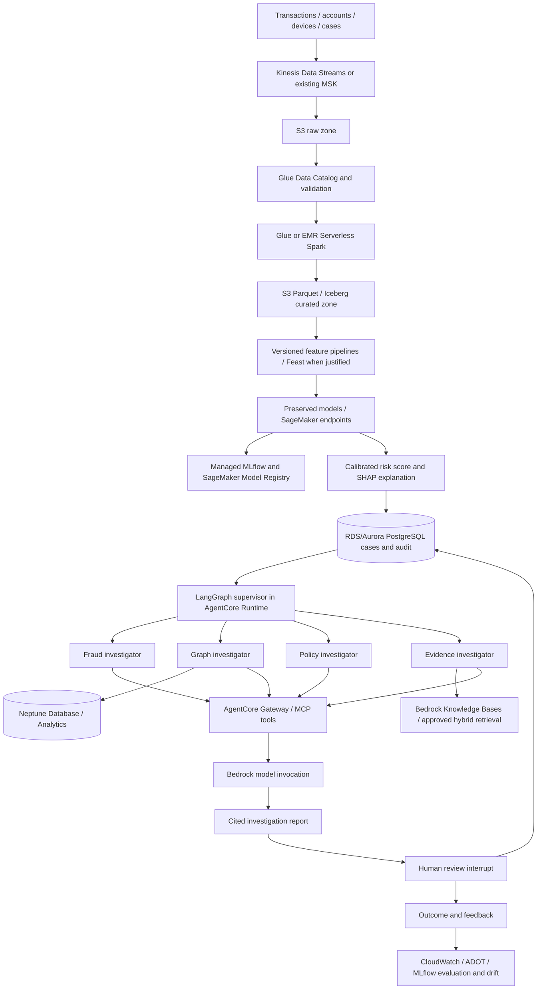

# AWS target architecture and implementation status

This is the governing target architecture for the Agentic Fraud Detection and Investigation Platform. Delivery remains incremental: preserve verified IEEE-CIS, Home Credit, and Elliptic components, place versioned adapters around them, and add production services only after their contracts and acceptance evidence are available.

## Current status

| Capability | Status | Repository evidence | AWS target |
| --- | --- | --- | --- |
| Case API and contracts | Implemented locally | FastAPI/Pydantic routes and typed domain contracts | API Gateway in front of the deployed API; Lambda only for short event-driven handlers |
| Durable case and audit data | Implemented locally | Async SQLAlchemy/psycopg, PostgreSQL, Alembic, append-only audit controls | RDS/Aurora PostgreSQL with KMS, private networking, backups, and IAM/secret-managed access |
| Existing model preservation | Enforced | Separate IEEE-CIS, Home Credit, and Elliptic registry entries; unavailable models fail closed | Wrap authoritative artifacts or SageMaker endpoints without changing preprocessing or class semantics |
| Portable inference | Implemented as an optional boundary | Checksum-pinned ONNX Runtime CPU/CUDA/OpenVINO adapter | SageMaker hosting where managed deployment is justified; retain ONNX as a portable serving option |
| API and agent guardrails | Implemented locally or as tested policy | RBAC/domain checks, limits, safe errors, model timeouts, tool/evidence budgets, citation checks, mandatory review packet | IAM and AgentCore Identity/Gateway enforcement, KMS, CloudWatch/CloudTrail evidence, deployment kill switches |
| Streaming ingestion | Not implemented | No Kafka/Kinesis client or event schema | Kinesis Data Streams by default; preserve Kafka/MSK if the authoritative portfolio already uses it |
| Data lake and ETL | Not implemented | No S3/Glue/EMR jobs or datasets in this repository | KMS-encrypted S3 zones, Glue Data Catalog/schema controls, Glue jobs or EMR Serverless Spark |
| Feature platform | Not implemented | No Feast repository or online/offline feature contract | Feast only after point-in-time-correct features and ownership are defined; reuse existing SageMaker feature infrastructure if present |
| Model training and governance | Existing examples only; artifacts absent | Baseline inventory records source/README discrepancies | SageMaker training/endpoints, managed MLflow experiments, SageMaker Model Registry, SHAP artifacts, approval gates |
| Fraud entity graph | Not implemented | Elliptic graph builder and model artifact are absent upstream | Neptune Database for operational relationships and fraud-ring traversal; Neptune Analytics for analytical graph workloads |
| Document retrieval and GraphRAG | Not implemented | Retrieval is only planned | S3 document source plus Bedrock Knowledge Bases; benchmark Neptune Analytics GraphRAG against a hybrid vector/keyword path |
| Agent workflow | Policy library only | No live LangGraph runtime or checkpoint tables | LangGraph supervisor and specialist nodes hosted in AgentCore Runtime, with tools exposed through AgentCore Gateway/MCP |
| Human review | Contract concept only | No durable investigation/review migrations or endpoints | PostgreSQL-backed interrupt/resume; authenticated reviewer decision remains authoritative |
| Observability and evaluation | Partial | Structured logging, correlation IDs, local tests and guardrail demo | ADOT/OpenTelemetry, CloudWatch logs/metrics/traces, CloudTrail, managed MLflow metrics and agent evaluation datasets |
| AWS infrastructure | Not implemented | No deployable IaC and no cloud resources claimed | Least-privilege IAM, KMS keys, VPC endpoints, alarms, budgets, retention policies, and environment-separated IaC |

“Not implemented” is intentional where the authoritative datasets, models, AWS account configuration, or evaluation fixtures are missing. The platform must not fabricate a working production component or silently replace a preserved model to make the diagram appear complete.

## Target flow

## Service choices

- Use **Kinesis** for a new AWS-native stream. Use Kafka through Amazon MSK only when existing producers, schemas, or operating requirements make Kafka the preserved interface.
- Store immutable raw records and validated curated records in separate **S3** prefixes/buckets with object versioning and KMS encryption. Use **Parquet** for columnar storage. Use **Iceberg** when atomic table changes, schema evolution, time travel, or concurrent engines are required; ordinary append-only exports do not need an open table format.
- Use **Glue** for cataloging, schema validation, and bounded scheduled ETL. Use **EMR Serverless/Spark** for sustained streaming, graph-scale transformations, or workloads that exceed Glue job constraints. Do not run both for the same transformation without a measured reason.
- Keep the three model domains separate. Track ROC-AUC, PR-AUC, precision, recall, F1, calibration, and false-positive rate per model and per time slice. Store SHAP values or stable reason codes with the model version and feature schema.
- Use **managed MLflow on SageMaker** for experiment lineage and synchronize approved model versions into **SageMaker Model Registry**. Promotion remains an explicit review step.
- Use **Neptune Database** for authoritative operational entity relationships. Use **Neptune Analytics** for large analytical traversals and Bedrock Knowledge Bases GraphRAG. Document-derived GraphRAG entities must not silently become authoritative fraud links.
- Keep **LangGraph** as the deterministic workflow and checkpoint model. Host it in **Bedrock AgentCore Runtime** after local durability tests pass. Expose narrow typed tools through **AgentCore Gateway/MCP**; tool authorization and case/domain scope are checked again inside the service.
- Use **Bedrock** for report synthesis over approved evidence. Every assertion that affects a recommendation needs an evidence identifier. Missing or conflicting evidence produces abstention or a request for more evidence.
- Keep **PostgreSQL** as the authoritative case, workflow, review, and audit store. Vector retrieval may use Bedrock Knowledge Bases, pgvector, or Qdrant only after a labeled benchmark. Retrieval storage is never the audit authority.
- Use **Lambda** for short event handlers, validation triggers, and asynchronous glue code. Long investigations, Spark jobs, model endpoints, and database-heavy API workloads use their purpose-built runtimes.

## Guardrails required before real data

1. Private networking and least-privilege IAM for every runtime, data bucket, model endpoint, graph, and tool.
2. Separate KMS keys and resource policies by environment and data class; secrets live in Secrets Manager or Parameter Store.
3. Event schemas, maximum payload sizes, idempotency keys, replay handling, dead-letter paths, and source timestamps are validated before storage.
4. S3 raw data is immutable; curated writes record source object versions, transformation version, row counts, and quality results.
5. PII is tokenized or minimized before Bedrock retrieval/invocation. Logs and traces exclude raw sensitive payloads by default.
6. AgentCore sessions, LangGraph run IDs, model versions, evidence IDs, tool calls, and reviewer decisions share traceable correlation identifiers.
7. Agents cannot approve recommendations or execute account, payment, lending, or law-enforcement actions. Only an authenticated human decision can close the review interrupt.
8. CloudWatch alarms cover ingestion lag, schema rejection, endpoint errors, drift, graph/retrieval failures, agent latency/cost, and review backlog.

## Delivery order

1. Recover authoritative models, preprocessing, datasets, AWS endpoint contracts, and golden predictions.
2. Persist model score provenance and connect exactly one verified model adapter without disturbing its source environment.
3. Add investigation-run, evidence, checkpoint, and review-decision schemas with restart and concurrency tests.
4. Establish S3/Glue contracts and one idempotent batch path before adding Kinesis or Spark streaming.
5. Add Neptune entity mappings for one domain and verify fraud-ring queries against labeled fixtures.
6. Add policy/case document ingestion and benchmark keyword, vector, hybrid, and GraphRAG retrieval using NDCG, MRR, Recall@k, latency, and cost.
7. Connect the bounded LangGraph workflow to AgentCore/Bedrock and preserve the human-review interrupt.
8. Add AWS infrastructure as code, CloudWatch/ADOT telemetry, failure drills, security review, and controlled deployment.

This order produces reviewable vertical slices and prevents expensive AWS infrastructure from hiding missing model contracts or weak evaluation data.

## AWS references

- [Bedrock AgentCore overview](https://docs.aws.amazon.com/bedrock-agentcore/latest/devguide/what-is-bedrock-agentcore.html)
- [AgentCore observability with CloudWatch and ADOT](https://docs.aws.amazon.com/bedrock-agentcore/latest/devguide/observability-configure.html)
- [Bedrock Knowledge Bases with Neptune Analytics GraphRAG](https://docs.aws.amazon.com/bedrock/latest/userguide/knowledge-base-build-graphs-build.html)
- [Managed MLflow on SageMaker AI](https://docs.aws.amazon.com/sagemaker/latest/dg/mlflow.html)
- [MLflow and SageMaker Model Registry synchronization](https://docs.aws.amazon.com/sagemaker/latest/dg/mlflow-track-experiments-model-registration.html)
- [Near-real-time Spark analytics on Kinesis, EMR, S3, Glue, and Iceberg](https://docs.aws.amazon.com/solutions/implementing-near-real-time-analytics-with-spark-streaming-on-aws/)
