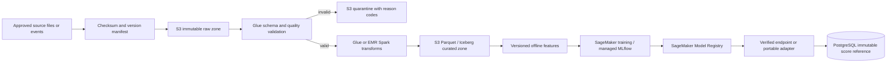

# Dataset catalog, controls, and AWS ingestion plan

## Repository data status

No IEEE-CIS, Home Credit, or Elliptic dataset file is committed to this repository. No local file, S3 object, Glue table, checksum manifest, or license approval has been supplied to this project. The existing source repositories refer to these datasets, but their inspected Git trees do not contain the authoritative data.

This repository contains contracts and plans only. Tests use synthetic records created during the test run. A dataset becomes usable only after its source, permitted use, object version, checksum, schema, and owner are recorded and approved.

| Domain key | Dataset | Prediction unit | Target/label | Current status |
| --- | --- | --- | --- | --- |
| `ieee_cis` | IEEE-CIS Fraud Detection | Online transaction | Binary `isFraud` probability | Authoritative files and preprocessing contract missing |
| `home_credit` | Home Credit Default Risk | Loan application, with related historical tables | Binary repayment/default target | Authoritative files, training implementation, and saved model missing |
| `elliptic` | Elliptic Bitcoin transaction graph | Transaction node in a directed temporal graph | Licit, illicit, or unknown node label | Graph builder, dataset files, feature mapping, and saved classifier missing |

The domains use unrelated identifiers. `TransactionID`, a Home Credit application/customer identifier, and an Elliptic transaction node ID are not interchangeable. Cross-domain joins are prohibited unless a separately governed mapping is supplied and validated.

## IEEE-CIS Fraud Detection

Authoritative candidate source: [Kaggle IEEE-CIS Fraud Detection data page](https://www.kaggle.com/c/ieee-fraud-detection/data). The source describes transaction and identity tables joined by `TransactionID`; some transactions have no identity row. The binary target is `isFraud`. `TransactionDT` is an elapsed time from an undisclosed reference and must not be presented as a real wall-clock timestamp.

Expected source files from the competition page:

- `train_transaction.csv`
- `train_identity.csv`
- `test_transaction.csv`
- `test_identity.csv`
- `sample_submission.csv`

Onboarding checks:

1. Record the accepted competition rules and approved purpose. The source marks the data as subject to competition rules; do not redistribute it in this public repository.
2. Pin every source file by SHA-256 and S3 version ID before transformation.
3. Verify `TransactionID` uniqueness within each table and measure transaction-to-identity match coverage without dropping unmatched transactions.
4. Preserve the original `TransactionDT` value and its relative-time meaning. Derive ordering/window features without inventing a calendar timestamp.
5. Confirm categorical encodings, missing-value behavior, positive-class mapping, feature order, and train/validation time boundary from the authoritative model pipeline.
6. Evaluate PR-AUC, ROC-AUC, precision, recall, F1, false-positive rate, calibration, and recall at the available investigation capacity. Random-only splits are insufficient when a temporal split is available.

## Home Credit Default Risk

Authoritative candidate source: [Kaggle Home Credit Default Risk data page](https://www.kaggle.com/c/home-credit-default-risk/data). The source describes one main application row per loan plus one-to-many bureau, prior-application, installment, credit-card, and point-of-sale histories. Access requires acceptance of the competition rules.

Expected source files from the competition page:

- `application_train.csv` and `application_test.csv`
- `bureau.csv` and `bureau_balance.csv`
- `previous_application.csv`
- `POS_CASH_balance.csv`
- `credit_card_balance.csv`
- `installments_payments.csv`
- `HomeCredit_columns_description.csv`
- `sample_submission.csv`

Onboarding checks:

1. Record approved use and redistribution restrictions before download or S3 upload.
2. Pin file checksums and object versions and preserve the supplied column-description file with the data manifest.
3. Validate every primary/foreign-key relationship and expected cardinality before joins. Aggregate one-to-many histories before attaching them to an application to prevent accidental row multiplication.
4. Split by the prediction unit so records related to one applicant/application cannot leak across train, calibration, validation, and test partitions.
5. Fit imputers, encoders, feature selection, imbalance treatment, and probability calibration on training data only. Preserve their serialized versions and feature order with the model.
6. Report ROC-AUC and PR-AUC with calibration, threshold metrics, false-positive rate, subgroup error analysis, and decision-capacity analysis. SHAP output must refer to the exact registered model and feature schema.

## Elliptic transaction graph

Research reference: [Anti-Money Laundering in Bitcoin: Experimenting with Graph Convolutional Networks for Financial Forensics](https://arxiv.org/abs/1908.02591). The paper describes a temporal directed graph with more than 200,000 transaction nodes, approximately 234,000 payment-flow edges, and 166 node features. The commonly distributed dataset contains licit, illicit, and unknown labels. Candidate distribution: [Elliptic Data Set on Kaggle](https://www.kaggle.com/datasets/ellipticco/elliptic-data-set).

Expected logical inputs, whose exact filenames and schema must be confirmed from the approved distribution:

- transaction-node features, including the time-step field
- directed transaction-to-transaction edges
- node classes/labels
- the distribution's schema/readme and license or terms

Onboarding checks:

1. Record the dataset version, license/terms, checksums, and source. Do not substitute Elliptic++ or another Bitcoin graph without a new domain/version contract.
2. Verify node-ID uniqueness, edge endpoint coverage, edge direction, self-loop/duplicate policy, feature count/order, label vocabulary, and time-step range.
3. Preserve unknown labels as unknown. Do not map them to licit or use them as supervised negatives without an approved methodology.
4. Preserve temporal ordering for training and evaluation. Prevent future graph neighborhoods or labels from leaking into earlier predictions.
5. Keep raw graph construction deterministic and versioned. Neptune identifiers must retain a reversible reference to the source node ID without exposing it to unauthorized users.
6. Report illicit-class PR-AUC, precision, recall, F1, false-positive rate, temporal stability, and fraud-ring/subgraph retrieval quality separately from node-classification metrics.

## Governed AWS layout

The following paths are templates, not evidence that buckets exist:

```text
s3://<data-bucket>/<environment>/raw/<domain>/source_version=<version>/ingest_date=<YYYY-MM-DD>/
s3://<data-bucket>/<environment>/quarantine/<domain>/run_id=<uuid>/
s3://<data-bucket>/<environment>/curated/<domain>/schema_version=<version>/event_date=<YYYY-MM-DD>/
s3://<artifact-bucket>/<environment>/models/<domain>/<model_version>/
s3://<artifact-bucket>/<environment>/manifests/<domain>/<dataset_version>.json
```

Required manifest fields:

| Field | Purpose |
| --- | --- |
| `domain` and `dataset_version` | Stable identity used by jobs, features, models, and audits |
| `source_uri` and approved-use reference | Provenance and license/terms evidence |
| `s3_uri`, `version_id`, `etag`, and `sha256` | Immutable object identity; ETag alone is not a content checksum |
| `schema_version` and Glue table/version | Schema evolution and reader compatibility |
| `row_count`, byte size, null/duplicate statistics | Reconciliation and anomaly detection |
| `event_time_semantics` and timezone | Prevent accidental timestamp invention or conversion |
| `label_definition` and class mapping | Preserve training and inference meaning |
| `split_definition` | Reproducible train/calibration/validation/test membership |
| `transform_version` and source-code revision | Reproducible curated data and features |
| `owner`, classification, retention, and deletion policy | Governance and access control |

## Validation and transformation flow



Every ETL run must be idempotent and record its input versions, watermark, code version, output objects, row counts, rejected rows, quality results, start/end timestamps, and terminal state. Failed runs resume from committed boundaries; they do not silently overwrite raw or previously approved curated data.

Use Parquet for curated columnar data. Use Iceberg only when schema evolution, atomic changes, time travel, or concurrent engines require table semantics. Dataset-specific transformations must use the preserved model's expected schema rather than a newly guessed schema.

## Security and publication rules

- Keep datasets, derived features, model binaries, local vector stores, graph exports, checkpoints, experiment artifacts, and credentials out of Git. `.gitignore` provides a local safeguard; S3/IAM policies and review remain authoritative.
- Encrypt S3, Glue, logs, model artifacts, and snapshots with environment-appropriate KMS keys. Use separate roles for ingestion, training, serving, investigation, and review.
- Block public S3 access, use private networking where required, log data-plane access, and test explicit-deny policies.
- Minimize or tokenize identifiers before retrieval or Bedrock calls. Do not put raw rows, identifiers, secrets, or unrestricted evidence in prompts, logs, traces, MLflow parameters, or GitHub Actions output.
- Store only source references and approved provenance in the investigation database. The current case API and score-provenance API do not persist raw feature payloads.
- Synthetic fixtures may be committed only under `tests/fixtures/`, must be visibly synthetic, must not resemble copied production records, and must contain no governed source data.

## Dataset onboarding exit criteria

A domain remains unavailable until all of the following pass:

1. Approved source and use terms are recorded.
2. Dataset objects and artifacts have immutable versions and SHA-256 checksums.
3. Schema, keys, labels, time semantics, missing values, and feature order are documented.
4. Raw-to-feature transformations reproduce from pinned inputs.
5. Golden predictions match the preserved model within predeclared tolerances.
6. Leakage, split, calibration, subgroup, and operational-capacity checks pass.
7. IAM/KMS/logging/retention controls pass deployment review.
8. The model owner approves the dataset, preprocessing, model version, and intended use.

Until then, the API must continue returning an explicit model-unavailable response rather than a placeholder prediction.
